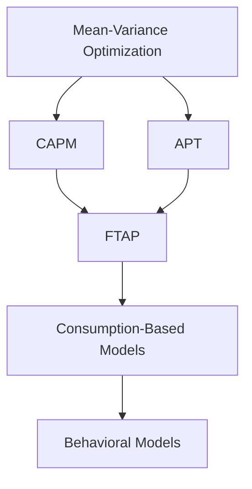

---
{"dg-publish":true,"permalink":"/axioms-in-asset-pricing/"}
---

---

### 1. **Mean-Variance Optimization (Markowitz, 1952)**
**Axioms**:  
- Investors are rational and risk-averse.  
- Portfolio decisions based solely on expected returns and variance of returns.  
- Markets are frictionless (no transaction costs/taxes).  

**Derived From**:  
Utility theory and statistical analysis of diversification.  

**Impact**:  
Introduced the concept of **efficient frontiers**, forming the basis for all subsequent equilibrium models.  

---

### 2. **Capital Asset Pricing Model (CAPM) (Sharpe, Lintner, Mossin, 1964)**  
**Axioms**:  
1. **Homogeneous expectations**: All investors share identical return and risk estimates.  
2. **Existence of a risk-free asset**: Unlimited borrowing/lending at a risk-free rate.  
3. **Single-period investment horizon**.  
4. **Perfectly divisible and liquid markets**.  

**Derived From**:  
Markowitz's mean-variance framework, with added equilibrium assumptions.  

**Key Contribution**:  
Expressed expected returns as $$ \mathbb{E}[R_i] = R_f + \beta_i (\mathbb{E}[R_m] - R_f) $$, linking returns to systematic risk (beta).  

---

### 3. **Arbitrage Pricing Theory (APT) (Ross, 1976)**  
**Axioms**:  
1. **No-arbitrage principle**: Markets eliminate risk-free profit opportunities.  
2. **Linear factor structure**: Returns driven by exposure to macroeconomic factors.  

**Derived From**:  
Critique of CAPM’s single-factor limitation. APT relaxed CAPM’s assumptions (e.g., no need for a market portfolio).  

**Impact**:  
Pioneered multi-factor models (e.g., Fama-French 3/5/6 factors) to explain cross-sectional returns.  

---

### 4. **Fundamental Theorem of Asset Pricing (FTAP) (Harrison-Kreps, 1979)**  
**Axioms**:  
1. **No free lunch with vanishing risk (NFLVR)**: Stricter no-arbitrage condition for infinite markets.  
2. **Existence of an equivalent martingale measure**: Prices are expectations under a risk-neutral measure $$ \mathbb{Q} $$.  

**Derived From**:  
Mathematical formalization of Black-Scholes hedging arguments.  

**Key Contribution**:  
Established $$ \text{No arbitrage} \iff \exists \mathbb{Q} \text{ s.t. } S_t = \mathbb{E}^\mathbb{Q}[e^{-rT}S_T] $$, foundational for derivatives pricing.  

---

### 5. **Consumption-Based Models (Breeden, 1979; Lucas, 1978)**  
**Axioms**:  
- **Stochastic discount factor (SDF)**: Prices reflect marginal utility of consumption across states/time.  
- **Rational expectations**: Agents maximize intertemporal utility.  

**Derived From**:  
General equilibrium theory and critique of CAPM’s static framework.  

**Formula**:  
$$ \text{Price} = \mathbb{E}[M_{t+1} \cdot \text{Payoff}_{t+1}] $$, where $$ M_{t+1} = \beta \frac{u'(c_{t+1})}{u'(c_t)} $$.  

---

### 6. **Behavioral Asset Pricing (Post-1980s)**  
**Axioms**:  
- **Investor irrationality**: Psychological biases (overconfidence, loss aversion) affect prices.  
- **Market anomalies**: Limits to arbitrage allow mispricing persistence.  

**Derived From**:  
Empirical failures of CAPM/APT (e.g., momentum, value effects).  

**Impact**:  
Integrated psychology into pricing models (e.g., prospect theory).  

---

### Evolutionary Logic:
1. **CAPM vs. APT**: CAPM’s reliance on unobservable market portfolios led to APT’s factor-based flexibility.  
2. **FTAP’s Universality**: Unified discrete and continuous-time models under a no-arbitrage umbrella.  
3. **Consumption Models**: Addressed CAPM’s static limitations by linking pricing to macroeconomic fundamentals.  
4. **Behavioral Models**: Reacted to neoclassical assumptions by incorporating cognitive biases.  

---

### Current Axiomatic Hierarchy:

**Why This Order Matters**:  
Each layer addressed prior limitations: CAPM introduced systematic risk, APT added multi-factor flexibility, FTAP mathematically formalized arbitrage, and behavioral models humanized decision-making. The progression mirrors finance’s shift from idealized rationality to empirical realism and mathematical rigor.
 